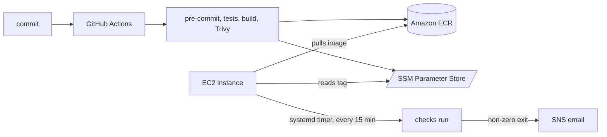

# service-watch

External uptime and TLS certificate monitoring for self-hosted services.

## Why this exists

Monitoring your own infrastructure from inside that infrastructure is circular. If the
host goes down, the monitor goes down with it and tells you nothing. `service-watch`
runs somewhere else — a container in AWS that watches services from the outside and
reports only what it can genuinely reach.

It answers questions you would otherwise learn about from a complaint:

- Is the service responding?
- Is the TLS certificate about to expire?

The second is quieter than it sounds. Automated certificate renewal fails silently:
nothing breaks for weeks, and then everything breaks at once.

## What it checks

| Check | Reports |
|-------|---------|
| HTTP  | Status code and response time |
| TLS   | Days remaining before expiry, warning below a configurable threshold |

A failing check exits non-zero. The application knows nothing about AWS — it signals
failure through its exit code, and the deployment decides what that means.

## Architecture

## Credentials

There are none. No password, key, or secret is stored anywhere in this system, and the
account contains no IAM access keys at all — `aws iam list-access-keys` returns empty.

| Actor | How it authenticates |
|-------|---------------------|
| The pipeline | GitHub OIDC federation — a signed token exchanged for credentials that expire in an hour |
| The host | EC2 instance profile — credentials fetched from the instance metadata service |
| A human | IAM Identity Center — browser sign-in issuing session credentials that expire |

Registry access on the host goes through the ECR credential helper, which fetches a
token on demand and never writes it to disk.

## Infrastructure

All 21 AWS resources are defined in Terraform under `terraform/` — IAM roles and
policies, the GitHub OIDC provider, ECR, the security group, SNS, SSM, KMS, and the EC2
instance. `terraform plan` reports no drift between the code and what is deployed.

State lives in S3: versioned, lock-protected using S3-native locking, and encrypted with
a customer-managed KMS key that has annual rotation enabled. State can contain sensitive
values, which is why it gets a customer-managed key while the alert topic uses the
AWS-managed one — the threat models differ.

`terraform fmt` and `terraform validate` run on every pull request through pre-commit.

**`terraform apply` is deliberately not automated.** Doing so would require granting the
pipeline permission to modify IAM — including the roles that constrain the pipeline
itself. Automating it properly needs a separate role, plan output reviewed in the pull
request, and a manual approval gate. That is a security design, not a checkbox, so
applies are run by a human until it is built.

## Running it

    docker run --rm \
      -e WATCH_TARGETS=https://example.com,https://status.example.com \
      -e WATCH_WARN_DAYS=14 \
      service-watch:latest

## Configuration

All configuration comes from the environment. Nothing specific to any deployment is
committed to this repository.

| Variable          | Default | Meaning |
|-------------------|---------|---------|
| `WATCH_TARGETS`   | (none)  | Comma-separated URLs to check |
| `WATCH_WARN_DAYS` | `14`    | Warn below this many days of certificate validity |

The threshold is 14 rather than 30 deliberately. Let's Encrypt certificates last 90 days
and renewal begins at 30, so fewer than 14 days remaining means renewal has already
failed repeatedly — a real problem rather than a routine countdown.

## Pipeline

Every pull request runs, in order:

1. Trivy install, pinned to the same version used locally
2. `pre-commit` — ruff, workflow linting, YAML validation, secret detection, bandit static analysis, Terraform fmt and validate, and a Trivy scan of the Terraform for misconfigurations
3. Unit tests
4. Container build
5. Trivy vulnerability report
6. Trivy gate — fails on CRITICAL findings that have fixes available

Merges to `main` additionally push a SHA-tagged image to ECR and publish that tag to
Parameter Store. The push is idempotent: it checks whether the tag already exists,
because ECR tag immutability rejects a re-push and pipeline steps should be safe to
re-run.

The gate blocks only on critical *and* fixable findings. Blocking on everything produces
a permanently red pipeline that people learn to bypass.

The IaC scan gates on HIGH and above. Config findings have no equivalent of "fixable" —
every one is something written in this repo — so the threshold sits lower than the image
gate. Findings deliberately not fixed live in `.trivyignore`, each with a written reason.
Unrestricted egress is the clearest: it is the highest-severity finding in the report and
it stays, because a monitor that cannot reach arbitrary endpoints cannot do its job.

Three kinds of scanning run against three kinds of artifact: bandit reads the Python for
vulnerable patterns, Trivy reads the container image for known CVEs, and Trivy reads the
Terraform for misconfigurations. Each gate was tested by deliberately introducing a
finding and confirming it blocked, rather than by observing that it passed.

Dependabot watches the base image, actions, and Python packages, grouped into one pull
request per ecosystem. Every update is validated by the full pipeline before it can merge.

## Deployment

Deployment is **pull-based**. The pipeline publishes the current image tag to SSM
Parameter Store; the instance reads it before each run and pulls that image. The pipeline
has no permission to execute anything on the host — it publishes a version, and the host
adopts it on its own schedule. A compromised pipeline cannot reach the server.

An EC2 instance runs the checks on a systemd timer every 15 minutes. The host has **no
inbound ports open**; administration is through SSM Session Manager, which the agent
initiates outbound. There is no SSH key and no port 22.

On failure, systemd's `OnFailure` starts a unit that publishes the last 20 journal lines
to SNS, so the alert email names the failing check rather than saying something broke.

## Development

    python3 -m venv .venv && source .venv/bin/activate
    pip install -r requirements.txt -r requirements-dev.txt
    pre-commit install
    python -m pytest -q

Dependencies are declared in `requirements.in` and `requirements-dev.in`, then locked:

    uv pip compile requirements.in -o requirements.txt
    uv pip compile requirements-dev.in -o requirements-dev.txt -c requirements.txt

Do not edit `requirements.txt` or `requirements-dev.txt` by hand — they are generated.
The `-c` flag constrains dev dependencies to versions already pinned for runtime, so
tests and production cannot drift apart.

For Terraform, supply your own `terraform/terraform.tfvars` with an `alert_email` value;
it is gitignored so no address is published here.

The test suite makes no network calls. HTTP behavior is exercised with test doubles, and
the system clock is injected rather than read, so certificate-expiry logic is
deterministic instead of depending on the date the suite happens to run.

## Known limitations

- **Nothing monitors the monitor.** A single instance with no redundancy: if it stops,
  the silence is indistinguishable from everything being fine. A heartbeat or dead-man's
  switch is the fix.
- **Alerts do not deduplicate.** A sustained outage emails every 15 minutes.
- **No DNS drift detection**, so a stale dynamic-DNS record and a genuine outage look
  the same.
- **The SNS email subscription cannot be created from scratch.** AWS requires a human to
  confirm by email, so a `terraform apply` against an empty account would leave it
  pending. It is importable and manageable, but not fully reproducible.
- **The software inside the instance is not managed as code.** Docker, the systemd units
  and the wrapper script were configured by hand. This has a concrete cost: the root EBS
  volume is unencrypted, and encrypting it would replace the instance and destroy that
  hand-built configuration. The finding is deferred in `.trivyignore` until provisioning
  moves into `user_data`, which is the next problem worth solving.
- **Workloads run in the AWS Organization's management account.** Acceptable for a
  single-account personal project; a separate member account is correct practice.

## Roadmap

- Configuration management for the instance's software, unblocking root volume encryption
- Heartbeat monitoring, so a dead monitor is noticed
- Alert deduplication
- DNS drift detection
