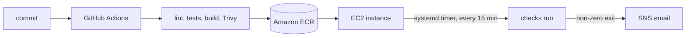

cat > README.md <<'EOF'
# service-watch

External uptime and TLS certificate monitoring for self-hosted services.

## Why this exists

Monitoring your own infrastructure from inside that infrastructure is circular. If the
host goes down, the monitor goes down with it and tells you nothing. `service-watch`
runs somewhere else  a container in AWS that watches services from the outside and
reports only what it can genuinely reach.

It answers questions you would otherwise learn about from a complaint:

- Is the service responding?
- Is the TLS certificate about to expire?

The second is quieter than it sounds. Automated certificate renewal fails silently:
nothing breaks for weeks, and then everything breaks at once.

## What it checks

| Check | Reports |
|-------|---------|
| HTTP  | Status code and response time |
| TLS   | Days remaining before expiry, warning below a configurable threshold |

A failing check exits non-zero, so the container composes with anything that reads exit
codes. The application knows nothing about AWS  the deployment decides what failure
means.

## Architecture

No credential exists anywhere in that chain. The pipeline authenticates to AWS with OIDC
federation; the instance authenticates with an instance profile.

## Running it

    docker run --rm \
      -e WATCH_TARGETS=https://example.com,https://status.example.com \
      -e WATCH_WARN_DAYS=14 \
      service-watch:latest

## Configuration

All configuration comes from the environment. Nothing specific to any deployment is
committed to this repository.

| Variable          | Default | Meaning |
|-------------------|---------|---------|
| `WATCH_TARGETS`   | (none)  | Comma-separated URLs to check |
| `WATCH_WARN_DAYS` | `14`    | Warn below this many days of certificate validity |

The threshold is 14 rather than 30 deliberately. Let's Encrypt certificates last 90 days
and renewal begins at 30, so fewer than 14 days remaining means renewal has already
failed repeatedly  a real problem rather than a routine countdown.

## Pipeline

Every pull request runs, in order:

1. `pre-commit`  ruff, workflow linting, YAML validation, secret detection
2. Unit tests
3. Container build
4. Trivy vulnerability report
5. Trivy gate  fails on CRITICAL findings that have fixes available

Merges to `main` additionally push a SHA-tagged image to Amazon ECR. The IAM role is
scoped to one repository, one branch, and one ECR resource.

The gate blocks only on critical *and* fixable findings. Blocking on everything produces
a permanently red pipeline that people learn to bypass.

## Deployment

An EC2 instance runs the image on a systemd timer every 15 minutes. It re-authenticates
to ECR before each run via `ExecStartPre`, using its instance profile  ECR tokens expire
after 12 hours, so a manual login would fail silently the next day.

The host has **no inbound ports open**. Administration is through SSM Session Manager,
which the agent initiates outbound. There is no SSH key and no port 22.

On failure, systemd's `OnFailure` starts a unit that publishes the last 20 journal lines
to SNS, so the alert email names the failing check rather than saying something broke.

## Development

    python3 -m venv .venv && source .venv/bin/activate
    pip install -r requirements.txt -r requirements-dev.txt
    pre-commit install
    python -m pytest -q

Dependencies are declared in `requirements.in` and `requirements-dev.in`, then locked:

    uv pip compile requirements.in -o requirements.txt
    uv pip compile requirements-dev.in -o requirements-dev.txt -c requirements.txt

Do not edit `requirements.txt` or `requirements-dev.txt` by hand  they are generated and
your changes will be overwritten. The `-c` flag constrains dev dependencies to versions
already pinned for runtime, so tests and production cannot drift apart.

The test suite makes no network calls. HTTP behavior is exercised with test doubles, and
the system clock is injected rather than read, so certificate-expiry logic is
deterministic instead of depending on the date the suite happens to run.

## Known limitations

- **The deployed image tag is pinned to a commit.** New images reach ECR but not the
  running host until the systemd unit is updated. Continuous delivery stops at the
  registry.
- **Infrastructure was created by hand** in the AWS console and is not yet codified.
- **Alerts do not deduplicate.** A sustained outage emails every 15 minutes.
- **No DNS drift detection**, so a stale dynamic-DNS record and a genuine outage look
  the same.

## Roadmap

- Automated deployment, so merges to `main` update the running service
- Terraform for the AWS resources
- Alert deduplication
- DNS drift detection
EOF
